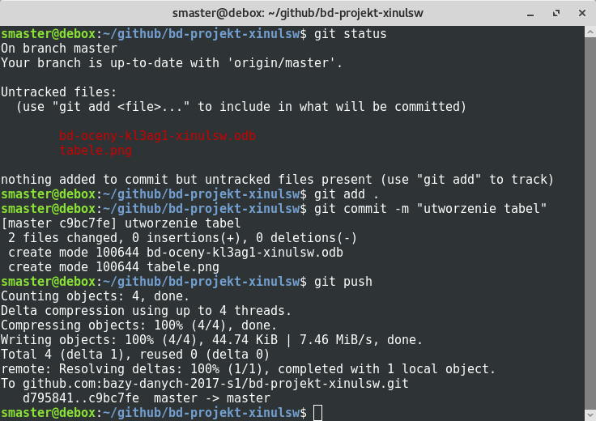
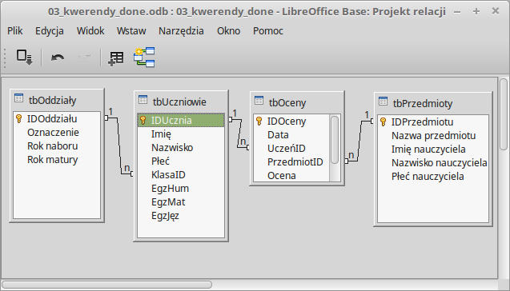

# Projektowanie bazy danych

## Dane

Dane zawarte są w plikach tekstowych w formacie "csv":

- *tbUczniowie.csv* – imię, nazwisko, płeć, identyfikator klasy, wynik egzaminu humanistycznego, wynik egzaminu matematycznego oraz wynik egzaminu językowego
- *tbklasy.csv* – oznaczenie, rok naboru i rok matury
- *tbOceny* – data otrzymania oceny, identyfikator ucznia, identyfikator przedmiotu, otrzymana ocena
- *tbPrzedmioty.csv* – nazwa przedmiotu, imię nauczyciela, nazwisko nauczyciela, płeć nauczyciela

## Zadanie

### Projekt bazy danych

Na podstawie danych zaprojektuj i utwórz bazę danych w programie LibreOffice Base. Baza powinna być
zapisana w pliku o nazwie wg wzorca: *bd-oceny-kl3ag1-nazwisko.odb*.

Do każdego pola dobierz odpowiedni typ danych, ustaw odpowiednie właściwości, np. format daty.
Nazwy tabel i pól dobierz adekwatnie do danych.

Zwróć uwagę, że we wszystkich tabelach należy utworzyć klucze główne typu liczba całkowita.

Utworzenie tabel zakończ migawką "utworzenie tabel" w repozytorium. Zob. przykład:

### Import danych

Zaimportuj dane z plików "csv" do bazy używając arkusza kalkulacyjnego, m. in. do wygenerowania
rosnących wartości kluczy głównych zaczynających się od 1.

Zwróć uwagę na kolejność importowania danych!

Import danych zakończ migawką "import danych" w repozytorium.

### Relacje

Tabele powiązane są relacjami widocznymi na poniższym zrzucie:

Utwórz odpowiednie relacje. **Uwaga**: nazwy tabel, a zwłaszcza pól możesz mieć inne.

Tworzenie relacji zakończ migawką "relacje" w repozytorium.
